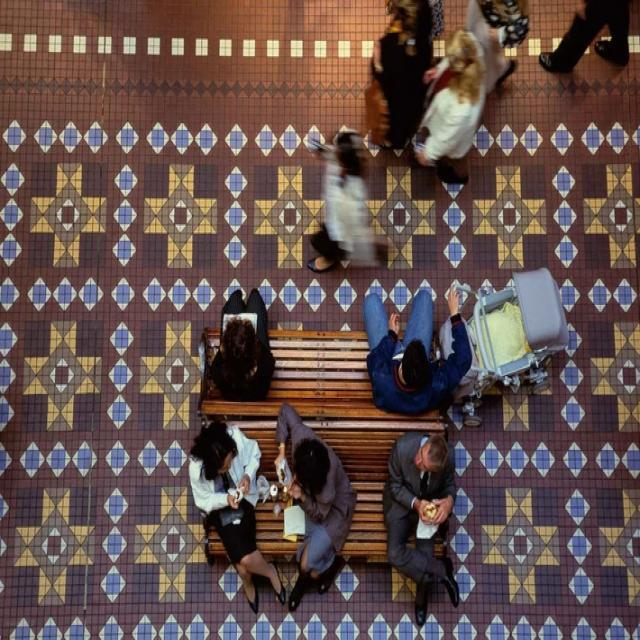

# Experiment: Fine-tuning YOLOv11 Models with Fisheye Synthetic Data

## 📌 Introduction
This experiment aims to evaluate the effectiveness of using synthetically distorted data, generated with the FishyFy tool, to fine-tune YOLOv11 models for person detection in real fisheye camera images. The primary goal is to test whether training models on transformed regular images can improve detection performance in fisheye data with high distortion.

Github Repository URL: https://github.com/RubenCasal/FishyFy-calibration-parameter 

### Motivation
Fisheye-distorted image data is often scarce and challenging to obtain. Additionally, fisheye distortion varies significantly across different camera models, making it impractical to collect sufficient real-world data for every use case. The FishyFy tool addresses this problem by transforming standard images to simulate fisheye effects, allowing users to fine-tune YOLO models with customized synthetic data that resembles the specific distortion pattern of their target camera. This approach aims to bridge the gap between the abundance of regular image data and the need for specialized fisheye datasets in computer vision applications.

#### Practical Use Case

One specific use case is aerial drone imagery. If we have labeled standard drone images for object detection and switch to a fisheye camera (e.g., a model with a wider field of view), we would typically need to recollect and re-label data. With FishyFy, we can transform the existing labeled images to the fisheye format, saving time and effort. Additionally, fisheye distortion varies significantly across different camera models, making it impractical to collect sufficient real-world data for every use case. The FishyFy tool addresses this problem by transforming standard images to simulate fisheye effects, allowing users to fine-tune YOLO models with customized synthetic data that resembles the specific distortion pattern of their target camera. This approach aims to bridge the gap between the abundance of regular image data and the need for specialized fisheye datasets in computer vision applications.

### Objective
The primary objective of this experiment is to validate the hypothesis that fine-tuning YOLOv11 models with FishyFy-generated synthetic fisheye data will lead to improved person detection performance when tested on real fisheye camera data.

## 📐 Calibration Parameters
The FishyFy tool uses camera calibration parameters as inputs to accurately simulate fisheye distortion on regular images. These parameters are crucial for generating synthetic data that closely resembles the real fisheye images captured by specific camera models.

### Intrinsic Matrix (K)
The intrinsic matrix `K` is a 3x3 matrix that contains the focal lengths and the optical center of the camera. It is defined as:
```
K = [[fx, 0, cx],
     [0, fy, cy],
     [0, 0, 1]]
```
- `fx`, `fy`: Focal lengths along the x and y axes.
- `cx`, `cy`: Optical center coordinates.

In the FishyFy tool, the values of `cx` and `cy` are automatically set to be half of the width and height of the input image, respectively. This ensures that the distortion is applied symmetrically around the center of the image.

### Distortion Coefficients (D)
The distortion coefficients `D` are a 1x4 array in the FishyFy tool, representing radial and tangential distortions:
```
D = [k1, k2, p1, p2]
```
- `k1`, `k2`: Coefficients for radial distortion, which causes straight lines to appear curved.
- `p1`, `p2`: Coefficients for tangential distortion, caused by lens misalignment.

#### Distortion Types
- **Barrel Distortion**: Caused by negative radial coefficients (`k1`, `k2`), where straight lines near the edges curve inward, giving a bulging effect.
- **Pincushion Distortion**: Caused by positive radial coefficients, where straight lines near the edges curve outward, creating a pinched effect.


## 📊 Datasets
To evaluate the effectiveness of the FishyFy tool, two datasets were selected based on their similarity in perspective and purpose:

1. **Real Fisheye Dataset**: A pedestrian detection dataset obtained from Roboflow. The images are captured from a CCTV camera positioned overhead, showing people from a top view with significant fisheye distortion. The dataset contains images from different cameras, but for this experiment, only the images from one specific camera were chosen to maintain consistency.
(Roboflow Dataset URL: https://universe.roboflow.com/nathan-odic/fish-eye)
<p align="center">
    
    
</p>

3. **Regular Top-View Pedestrian Dataset**: A dataset of pedestrians captured from a top view but without fisheye distortion. This dataset serves as the base for generating synthetic fisheye data using FishyFy.
 (Roboflow Dataset URL: https://universe.roboflow.com/sang-oacf6/nguyensang)
<p align="center">
    
    
</p>

### Dataset Matching
Since the goal is to replicate the fisheye distortion from the real dataset, the calibration parameters for the synthetic data were obtained through trial and error. The FishyFy tool was configured to generate distortion similar to the CCTV fisheye effect to ensure realistic synthetic data.
<p align="center">
    
    
</p>

### 🏋️ Training Setup
The model chosen for training is the **YOLOv11m** model, as it balances performance and efficiency. To evaluate the impact of synthetic fisheye data, the following training strategy was applied:

1. **Model Fine-Tuning**:
   - The YOLOv11m model was fine-tuned using the synthetic fisheye dataset generated with FishyFy.
   - The training process was conducted for **5, 10, 20, and 40 epochs** to analyze the effect of increasing training duration.

2. **Baseline Comparison**:
   - The fine-tuned model results were compared against the original YOLOv11m model without any fine-tuning on fisheye data.

### 📊 Results
The models were evaluated on **342 images** using an **image size of 640x640**, an **IoU threshold of 0.5**, and a **confidence threshold of 0.5**.

<div align="center">

| Model         | Precision | Recall | mAP@0.5 | mAP@0.5:0.95 |
|--------------|----------|-------|--------|-------------|
| YOLOv11m      | 0.7545   | 0.2961| 0.5269 | 0.2844      |
| **5 Epochs**  | 0.9328   | 0.2535| 0.6001 | 0.2930      |
| **10 Epochs** | 0.9466   | 0.3955| 0.6763 | 0.2723      |
| **20 Epochs** | 0.9160   | 0.3316| 0.6327 | 0.2738      |
| **40 Epochs** | 0.9704   | 0.2657| 0.6201 | 0.3241      |

</div>

<p align="center">

</p>

#### Original labels
<p align="center">

</p>

#### YOLOv11m

<p align="center">

</p>

#### 5 EPOCHS
<p align="center">

</p>

#### 10 EPOCHS
<p align="center">

</p>

#### 20 EPOCHS
<p align="center">

</p>

#### 40 EPOCHS
<p align="center">

</p>

## 🔍 Final Conclusion
The experiment demonstrates that fine-tuning YOLOv11m models using synthetic fisheye data generated by the FishyFy tool can significantly improve object detection performance when applied to real fisheye images. The key findings are as follows:

1. **Precision Improvement:** Fine-tuning with synthetic data enhanced precision compared to the baseline YOLOv11m model, especially after training for 40 epochs.

2. **Recall Variation:** Recall did not consistently improve with more epochs, indicating that longer training may not always yield better generalization for all metrics.

3. **Optimal Training Duration:** Training for 10 epochs provided the best balance between precision and recall, with the highest mAP@0.5.

4. **Efficiency:** The FishyFy tool proved effective in generating fisheye-like transformations, reducing the need to collect and annotate new datasets when switching between different camera types.

In conclusion, the use of FishyFy-generated synthetic fisheye data is a viable strategy to enhance object detection models without the burden of collecting extensive real fisheye datasets. This technique is especially beneficial when dealing with cameras of varying distortion patterns or when rapidly adapting to new hardware setups.


